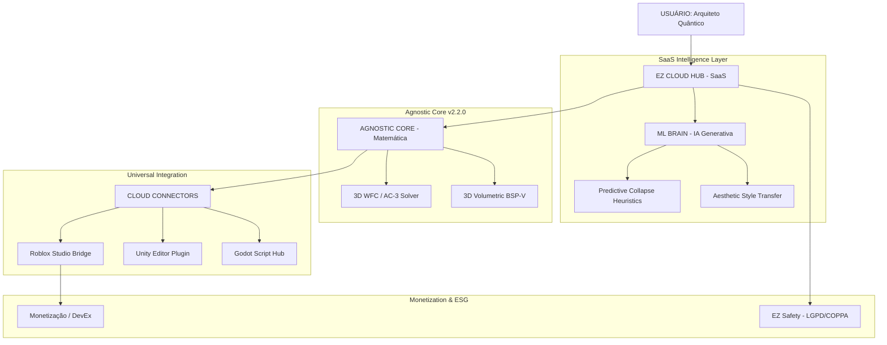

# MAPA DE SESSÕES E ROADMAP DO SISTEMA (v2.2.0) 🗺️🚀

**PROJETO**: EZ Studios - Agnostic AI SaaS  
**OBJETIVO**: Mapear a jornada do "Arquiteto Quântico" do onboarding web à monetização universal.

---

## 🗺️ MAPA MENTAL DO ECOSSISTEMA (SaaS & AI)

---

## 📅 ROADMAP DE SESSÕES (JORNADA DO ARQUITETO)

### Sessão 0: "Acentuando a Intenção" (Nuvem)
- **Ação**: O usuário digita uma descrição semântica no Web Hub.
- **Milestone**: O **ML Brain** interpreta a intenção e gera o blueprint inicial instantaneamente.

### Sessão 1: "Esculpindo a Matemática"
- **Foco**: Editor de Adjacência e Pesos no browser.
- **Tarefa**: Usar o preview em tempo real (Three.js) para ajustar a topologia do mundo.
- **Aprendizado**: Lógica de restrições (AC-3) de forma visual.

### Sessão 2: "Art Finalization & Estética"
- **Foco**: Aesthetic Selector (Quantum, Cybernetic, etc).
- **Tarefa**: Aplicar camadas de "WOW factor" que traduzem geometria em arte finalizada.
- **Aprendizado**: Direção de arte assistida por IA.

### Sessão 3: "Deploy Universal (One-Click)"
- **Foco**: Cloud Connectors.
- **Tarefa**: Exportar o mundo gerado diretamente para Roblox ou Unity.
- **Aprendizado**: Integração de sistemas e pipeline de produção profissional.

---

## 📈 ROADMAP ESTRATÉGICO (GO-TO-MARKET)

| Versão | Codinome | Milestone Técnico | Foco de Investimento |
|--------|----------|-------------------|-------------------|
| **v2.2** | **Agnostic** | Core Cloud + Web Hub UI | **M&A Readiness / Seed** |
| **v2.5** | **Neural** | ML Brain (Predictive Collapse) | **Series A (Scale)** |
| **v3.0** | **Universal** | Mercado Global B2B (Escolas + Estúdios) | **Dominância de Mercado** |

---

## ⚡ FLUXO DE EXECUÇÃO (INTEGRAÇÃO TOTAL)

1. **WEB INPUT**: `Editor.tsx` captura a Intenção do Arquiteto.
2. **AI PROCESSING**: `ml_brain` otimiza os pesos matemáticos (Heurística).
3. **CORE ENGINE**: `intentCompiler.ts` resolve o colapso zero entropia.
4. **CLOUD SYNC**: `webApi.ts` despacha o asset finalizado via Connectors.
