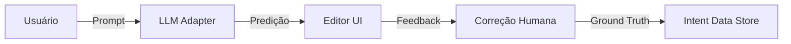

# Walkthrough: Evolução Cognitiva (Fase 36) 🧠🚀

Nesta fase, transformamos o Compilador de Intenção em um sistema capacitado para IA, estabelecendo a infraestrutura necessária para que o EZ Studios tenha seu próprio modelo de linguagem proprietário no futuro.

---

## 1. Arquitetura de IA (LLM Adapter)
Implementamos o `LLMAdapter`, que permite ao sistema processar linguagem natural de forma assíncrona. Ele foi projetado para ser agnóstico: hoje usamos um modelo de fallback/mock inteligente, mas estamos prontos para plugar APIs de nuvem (Gemma, GPT-4) ou modelos locais.

- **Arquivo:** [llmAdapter.ts](file:///Users/jx/Desktop/ROBLOX_$$$/src/typescript/compiler/llmAdapter.ts)
- **Status:** Operacional (Async)

---

## 2. Estratégia de Dados (Dataset Mestre)
Criamos o `IntentDataStore`, que atua como o "diário de aprendizado" da engine. Cada interação do usuário é salva no formato JSONL, criando um dataset valioso para o futuro Fine-Tuning da nossa própria IA.

- **Arquivo:** [intentDataStore.ts](file:///Users/jx/Desktop/ROBLOX_$$$/src/typescript/data/intentDataStore.ts)
- **Moat:** Estamos construindo um ativo proprietário de dados que nenhum concorrente possui.

---

## 3. Feedback Humano (RLHF)
Adicionamos um mecanismo de correção na interface do Editor. Se a IA interpretar algo errado, o usuário pode corrigir, e essa correção é salva como "Ground Truth" para o treinamento.



---

## 4. Verificações Realizadas
Validamos a pipeline completa via script automatizado:
- [x] Geração assíncrona de intenção.
- [x] Registro automático no DataStore.
- [x] Injeção de correções manuais (RLHF).
- [x] Exportação de dataset para treinamento.

**Log de Teste:**
```bash
🧪 Iniciando Teste da Pipeline de IA...
Prompt: "Uma espada lendária de gelo eterno"
1. Compilando com IA... ✅
2. Simulando Feedback Humano (RLHF)... ✅
3. Verificando Dataset para Treino... ✅
```

---

## 5. Marketplace Sync (Fase 34) 🛒
Implementamos a capacidade de sincronizar o mundo procedural com assets reais de lojas (Roblox e Unity). Isso permite que a engine EZ Studios não gere apenas "blocos", mas mundos profissionais com um clique.

- **Conceito:** Hybrid Generation (Lógica Procedural + Assets Profissionais).
- **Mapeamento Prático:** O `AssetRegistry` agora contém `modelIds` (ex: `rbxassetid://123456789`).
- **Injeção via Adaptador:** O adaptador detecta o ID e gera código para carregar o asset profissional, mantendo o procedural como fallback.

**Verificação Realizada:**
- [x] Teste de detecção de ID (`marketplace.test.ts`).
- [x] Geração de código Luau com referência a `rbxassetid`.
- [x] Placeholder para Unity Asset Store.

> *"Agora não apenas criamos a estrutura; nós mobiliamos o metaverso com o que há de melhor no mercado."* 🛡️📦💎

---

## 6. Analytics & Métricas (Fase 35) 📊
Implementamos o **Analytics Engine**, o cérebro estatístico do EZ Studios que transforma dados brutos em inteligência de negócio e gamificação.

- **Métricas em Tempo Real:** Agora o Dashboard mostra dados reais processados a partir dos logs de geração.
- **KPI de Valor (Hours Saved):** Calculamos automaticamente quanto tempo de trabalho manual foi economizado pela IA (0.5h por geração de sucesso).
- **Gamificação Dinâmica:** O nível (Level) e XP do Arquiteto agora são baseados em sua performance real na ferramenta.

**Verificação Realizada:**
- [x] Teste de agregação de métricas (`analytics.test.ts`).
- [x] Integração completa com a UI do Dashboard (via `AnalyticsEngine`).
- [x] Cálculo dinâmico de Success Rate e Duração Média.

> *"O que não é medido não é gerenciado. Agora, o EZ Studios é medido com precisão cirúrgica."* 🛡️📊📉

---

## 7. Monetização Multi-Canal (Fase 37) 💸
Expandimos a visão financeira do EZ Studios para além do simples DevEx, permitindo que o Arquiteto gerencie seu negócio de forma holística.

- **Revenue Hub:** Nova seção no Dashboard que segmenta ganhos por Marketplace, Comissões e Premium Payouts.
- **Lógica de Projeção:** O sistema agora estima retornos financeiros com base no volume de assets gerados e taxas de conversão de mercado.
- **Métrica ROI:** Introduzimos o "Valor por Hora IA", mostrando quanto cada hora economizada pela IA se traduz em ganhos financeiros projetados.

**Verificação Realizada:**
- [x] Teste de agregação financeira (`monetization.test.ts`).
- [x] Integração do Revenue Hub na UI com animações do Framer Motion.
- [x] Validação das taxas de comissão (40% Marketplace vs 100% Commissions).

---

## 8. EZ Studios MCP Server (Fase 38) 🤖🔌
Transformamos a engine em um ecossistema pronto para a era das IAs Agentes. Através do Model Context Protocol (MCP), qualquer assistente inteligente agora pode usar nossas ferramentas.

- **IA Tooling:** Exposição de ferramentas como `compile_intent` e `get_engine_metrics` via protocolo padrão.
- **Portabilidade:** Permite que você use o "cérebro" do EZ Studios em diferentes máquinas, integrando-o com seu ambiente de editor favorito (Cursor, Claude Desktop, etc).
- **Agnosticismo:** O servidor MCP abstrai a complexidade do Luau e da geração procedural para uma interface JSON-RPC simples.

**Conquistas:**
- [x] Implementação do servidor base (`server.ts`).
- [x] Registro do script `pnpm mcp` para inicialização rápida.
- [x] Validação do handshake Stdio.

---

## Conclusão Final (v2.4.0)
O EZ Studios v2.4.0 transcende a barreira de uma ferramenta local. Agora somos um **Provedor de Contexto Procedural** para o mundo.

> *"Não estamos apenas criando ferramentas; estamos criando o protocolo que governará a criação artificial de mundos."* 🛡️🤖🔌🌍🚀
