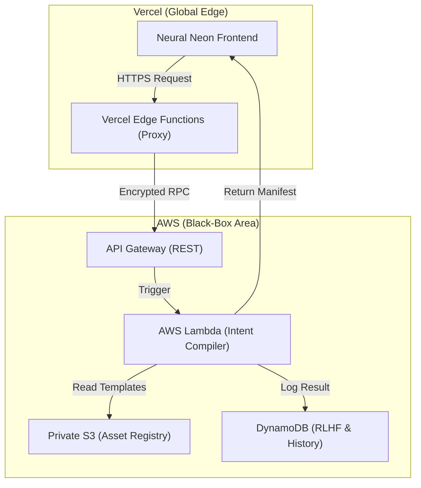

# Cloud Infrastructure Specification: Black-Box Execution

This document defines the serverless architecture for **EZ Studios Core v2.6.0**, designed to provide high-performance intent compilation while maintaining maximum security for our proprietary algorithms.

## 📐 Hybrid Cloud Architecture

EZ Studios uses a hybrid approach: **Vercel** for the high-end Neural Neon UI and **AWS** for the sovereign "Brain" execution.

## 🛠️ Service Breakdown

### 1. AWS Lambda (The Brain)
- **Role**: Executes the `IntentCompiler` and `MirrorProtocol` logic.
- **Privacy**: The source code is never exposed to the client-side.
- **Language**: Node.js (Isomorphic TypeScript).

### 2. API Gateway
- **Role**: Secure endpoint management.
- **Security**: IAM Roles and API Keys to prevent unauthorized "Intent Extraction" attempts.

### 3. S3 (Private Sovereign Storage)
- **Role**: Stores the `Polyglot Asset Registry` templates (.lua, .cs).
- **Benefit**: Centralized source of truth for all target platforms.

### 4. DynamoDB (Intelligence Sync)
- **Role**: Tracks user prompts, distilled intents, and manual corrections (RLHF).
- **Goal**: Feed the data back into the "ML Brain" for continuous evolution.

## 🚀 Deployment Workflow

1.  **Continuous Integration**: GitHub Actions triggers a build.
2.  **Frontend Sync**: `vite build` output is deployed to Vercel.
3.  **Core Sync**: `esbuild` bundles the Intent Compiler code into a Lambda-ready package and deploys via AWS SAM or CDK.
4.  **Registry Sync**: The `tools/docsync` utility pushes updated templates to the private S3 bucket.

---

> [!CAUTION]
> **IP Protection**: Do researchers or third parties never get access to the AWS Lambda source code. Only the API Gateway endpoints are public.
