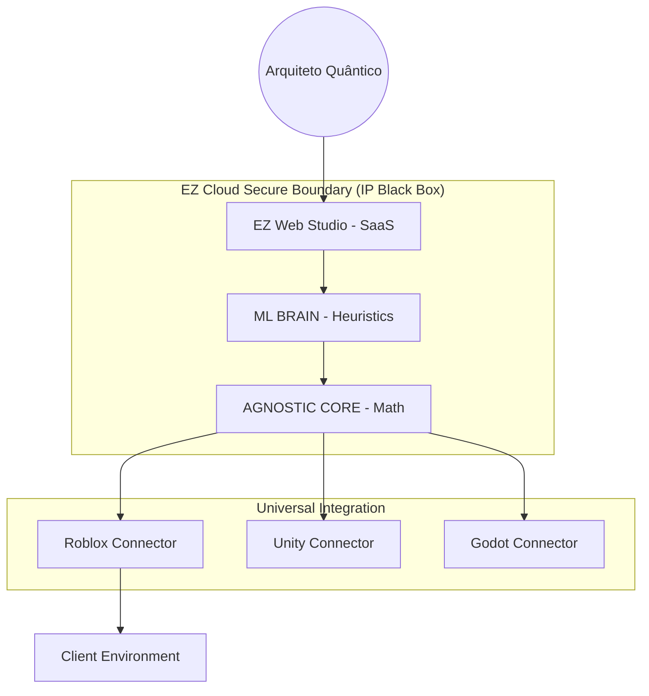

# 🌐 EZ Studios: Universal Web Hub Architecture (SaaS v2.2.0)

A globally accessible **Generative Intelligence Platform** for Quantum Architects.

## 1. System Vision: The "Black Box" Intelligence
The Web Hub acts as the secure execution environment for the EZ Agnostic Core. By centralizing generation in the cloud, we provide:
- **IP Fortress**: Proprietary algorithms (Intent Compiler, ML Brain) never leave our secure servers.
- **ML Elasticity**: GPU-accelerated workers for real-time Neural Procedural generation.

### Core Strategic Pillars:
- **Generative UI (GenUI)**: Adaptive web interface that evolves based on the user's semantic intent.
- **ML Brain Interface**: Direct connection to our Procedural Neural Networks for predictive design.
- **Universal Connectors**: Lightweight "Thin Client" plugins for Roblox, Unity, and Godot.

## 2. Technical Stack (Cloud-Centric)
| Layer | Technology | Role |
|-------|------------|------|
| **Frontend** | Next.js + Three.js | SaaS Portal & WOW Preview |
| **Intelligence** | ML Brain (PyTorch) | Predictive Collapse & Style Transfer |
| **Core** | Agnostic Core v2.2.0 | Mathematical Determinism (AC-3/WFC) |
| **Bridge** | Cloud Connectors | Secure IP Dispatch to Engines |

## 3. High-Level Architecture (Mermaid)

## 4. Strategic SaaS Revenue Streams
1. **The Architect Tier (SaaS)**: Monthly subscription for advanced procedural templates and storage.
2. **API Licensing (B2B)**: Allowing third-party games to use the EZ Core for in-game infinite content.
3. **Marketplace (Minor Protective)**: Safe percentage fee on asset trades between young developers.

---
**EZ Web Hub** — *The future of game dev is browser-native and intent-driven.*
